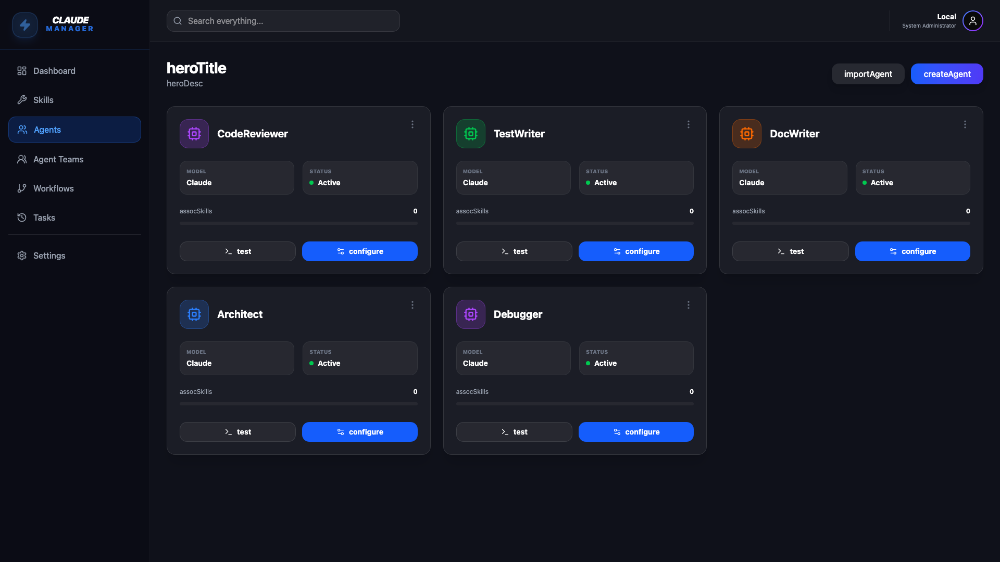
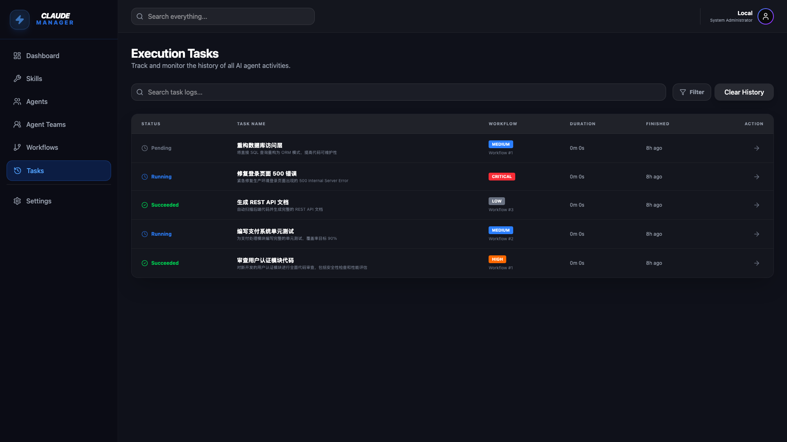

# Claude Manager

<div align="center">



**统一管理 Claude AI 生态的专业工具**

[](https://github.com/your-repo/claude-manager/releases)
[](LICENSE)
[](https://github.com/your-repo/claude-manager)

[下载最新版本](#-下载安装) · [快速开始](#-快速开始) · [功能特性](#-核心功能) · [文档](docs/)

</div>

---

## 🎯 设计理念

Claude Manager 基于三大核心设计理念打造，为 AI 开发者提供全新的管理体验：

### 1. 🤖 AI Agent 管理与编排

**统一管理平台** - 一站式管理 Skills、Agents、Teams、Workflows 和 Tasks

- **可视化编排**：拖拽式工作流设计，DAG 流程可视化
- **多智能体协作**：Team 机制支持多个 Agent 协同工作
- **实时监控**：WebSocket 实时追踪执行状态，支持历史回放
- **深度集成**：与 Claude Code CLI 无缝对接，自动同步配置


*可视化工作流编排 - 支持 Agent、Skill、Condition、Parallel 等多种节点类型*

### 2. 📱 移动端优先设计

**响应式界面** - 完美适配桌面、平板和移动设备

- **自适应布局**：从手机到 4K 显示器，流畅体验
- **触控优化**：针对触摸操作优化的交互设计
- **离线支持**：本地数据库，无需联网即可管理配置
- **轻量快速**：基于 Vite + React 19，秒级启动


*Teams 管理界面 - 响应式设计，支持多端访问*

### 3. 🎮 游戏化体验

**双模式界面** - 专业模式 + 冒险模式，让 AI 管理更有趣

- **冒险模式**：游戏化 UI，将 Agent 视为角色，Skill 视为技能
- **专业模式**：传统管理界面，适合企业和团队使用
- **动态效果**：流畅的动画和交互反馈
- **主题切换**：支持亮色/暗色主题，个性化定制


*Tasks 执行监控 - 实时状态更新，支持后台执行*

---

## ✨ 核心功能

### 📚 Skills 管理
- AI 辅助生成技能结构
- 支持 scripts、references、assets
- 全局/项目/插件三级作用域
- 一键同步到 Claude Code

### 🤖 Agents 管理
- 可视化配置界面
- 支持工具、权限、模型选择
- Scope 配置（user/project/plugin）
- 实时测试和调试

### 👥 Teams 管理
- 成员角色管理
- 协作策略配置
- 团队执行监控

### 🔄 Workflows 管理
- DAG 流程编排
- 节点类型：Agent、Skill、Condition、Parallel
- 可视化执行追踪
- 模板库支持

### 📋 Tasks 管理
- 实时执行状态
- 执行历史回放
- WebSocket 实时更新
- 后台执行支持

---

## 🏗️ 技术架构

### 三层架构设计

```
┌─────────────────────────────────────┐
│         UI Layer (React)            │  现代化 Web 界面
├─────────────────────────────────────┤
│      Service Layer (FastAPI)        │  业务逻辑和编排
├─────────────────────────────────────┤
│    Adapter Layer (Claude Code)      │  Claude 环境集成
└─────────────────────────────────────┘
```

### 技术栈

**后端**：
- Python 3.14 + FastAPI
- SQLAlchemy 2.0 (async)
- WebSocket 实时通信
- SQLite/PostgreSQL

**前端**：
- React 19 + Vite 6
- TypeScript
- Tailwind CSS 4
- Motion (Framer Motion)

---

## 📦 下载安装

### 方式一：下载预编译包（推荐）

#### macOS (Apple Silicon)
```bash
# 下载最新版本
curl -L -o claude-manager.tar.gz \
  https://github.com/your-repo/claude-manager/releases/download/v0.1.5/claude-manager-v0.1.5-macos-arm64.tar.gz

# 解压
tar -xzf claude-manager.tar.gz
cd claude-manager-v0.1.5-macos-arm64

# 启动
./start.sh
```

#### Linux (x86_64)
```bash
# 下载最新版本
curl -L -o claude-manager.tar.gz \
  https://github.com/your-repo/claude-manager/releases/download/v0.1.5/claude-manager-v0.1.5-linux-x86_64.tar.gz

# 解压
tar -xzf claude-manager.tar.gz
cd claude-manager-v0.1.5-linux-x86_64

# 启动
./start.sh
```

### 方式二：从源码安装

#### 前置要求
- Python 3.14+
- Node.js 18+
- Claude Code CLI (可选)

#### 安装步骤

```bash
# 1. 克隆项目
git clone https://github.com/your-repo/claude-manager.git
cd claude-manager

# 2. 后端安装
cd backend
python -m venv venv
source venv/bin/activate  # Windows: venv\Scripts\activate
pip install -r requirements.txt

# 3. 初始化数据库
alembic upgrade head

# 4. 启动后端
python run.py

# 5. 前端安装（新终端）
cd frontend
npm install
npm run dev
```

---

## 🚀 快速开始

### 启动应用

使用预编译包：
```bash
./start.sh
```

或从源码启动：
```bash
# 终端 1 - 启动后端
cd backend
source venv/bin/activate
python run.py

# 终端 2 - 启动前端
cd frontend
npm run dev
```

### 访问应用

- **前端界面**：http://localhost:3000
- **API 文档**：http://localhost:8000/docs
- **健康检查**：http://localhost:8000/api/system/health

### 基本使用流程

1. **配置项目路径**
   - 进入设置页面
   - 添加需要扫描的项目路径
   - 系统会自动扫描 project 级别的 skills 和 agents

2. **同步 Claude 配置**
   - 点击 Dashboard 的"同步"按钮
   - 系统会从 `~/.claude` 目录读取配置
   - 自动导入 Skills、Agents、Teams

3. **创建 Workflow**
   - 进入 Workflows 页面
   - 点击"新建 Workflow"
   - 拖拽节点设计流程
   - 保存并测试

4. **执行 Task**
   - 进入 Tasks 页面
   - 选择 Workflow 创建 Task
   - 点击"执行"开始运行
   - 实时查看执行状态

---

## 📖 使用方法

### Skills 管理

```bash
# 1. 创建新 Skill
点击 Skills 页面的"新建 Skill"按钮
填写名称、描述、作用域
添加 scripts、references、assets

# 2. 同步到 Claude Code
点击"同步到 Claude"按钮
系统会自动写入 ~/.claude/skills/ 目录

# 3. 在 Claude Code 中使用
claude --skill your-skill-name
```

### Agents 配置

```bash
# 1. 创建 Agent
点击 Agents 页面的"新建 Agent"按钮
配置名称、描述、模型
选择可用的 Skills 和工具

# 2. 测试 Agent
点击"测试"按钮
输入测试指令
查看执行结果

# 3. 同步到 Claude Code
点击"同步到 Claude"按钮
系统会自动写入 ~/.claude/agents/ 目录
```

### Workflows 编排

```bash
# 1. 创建 Workflow
拖拽节点到画布
连接节点形成流程
配置每个节点的参数

# 2. 节点类型
- Agent 节点：执行特定 Agent
- Skill 节点：执行特定 Skill
- Condition 节点：条件分支
- Parallel 节点：并行执行

# 3. 执行 Workflow
保存 Workflow
创建 Task 并执行
实时监控执行状态
```

### Teams 协作

```bash
# 1. 创建 Team
点击 Teams 页面的"新建 Team"按钮
添加成员 Agents
配置协作策略

# 2. 配置协作模式
- Sequential：顺序执行
- Parallel：并行执行
- Hierarchical：层级协作

# 3. 执行 Team Task
创建 Team Task
系统会自动协调多个 Agents
查看协作执行结果
```

---

## 🎨 界面模式

### 专业模式（Professional Mode）
- 传统管理界面
- 蓝色主题
- 适合企业和团队使用
- 功能完整，操作高效

### 冒险模式（Adventure Mode）
- 游戏化界面
- 黄色主题
- Agent 视为角色，Skill 视为技能
- 动态效果，趣味体验

**切换方式**：设置页面 → 界面模式 → 选择模式

---

## 📱 移动端使用

### 响应式断点
- **手机**：< 640px
- **平板**：640px - 1024px
- **桌面**：> 1024px

### 移动端优化
- 侧边栏自动折叠
- 触控手势支持
- 简化操作流程
- 优化加载速度

### 推荐浏览器
- Safari (iOS)
- Chrome (Android)
- Firefox Mobile
- Edge Mobile

---

## 🔧 配置说明

### 环境变量

创建 `backend/.env` 文件：

```bash
# 应用配置
APP_NAME=Claude Manager
APP_VERSION=0.2.0
DEBUG=false

# 数据库
DATABASE_URL=sqlite+aiosqlite:///./claude_manager.db

# Claude 配置
CLAUDE_CLI_PATH=/usr/local/bin/claude
CLAUDE_CONFIG_DIR=~/.claude

# 项目路径（可选）
PROJECT_PATH=/path/to/your/projects

# API 密钥（可选）
ANTHROPIC_API_KEY=your-api-key-here
```

### Claude Code 集成

确保 Claude Code CLI 已安装：

```bash
# 检查安装
claude --version

# 配置路径
export CLAUDE_CLI_PATH=$(which claude)
```

---

## 📊 系统要求

### 最低配置
- **CPU**：双核 2.0 GHz
- **内存**：4 GB RAM
- **存储**：500 MB 可用空间
- **系统**：macOS 11+ / Ubuntu 20.04+ / Windows 10+

### 推荐配置
- **CPU**：四核 3.0 GHz
- **内存**：8 GB RAM
- **存储**：2 GB 可用空间
- **系统**：macOS 13+ / Ubuntu 22.04+

---

## 🗺️ 开发路线图

- ✅ Phase 0: 项目骨架搭建
- ✅ Phase 1: 核心领域模型
- ✅ Phase 2: ClaudeAdapter 实现
- ✅ Phase 3: 前端集成
- ✅ Phase 4: 工作流执行引擎
- 🚧 Phase 5: 可视化编辑器
- 📋 Phase 6: 深度协作
- 📋 Phase 7: 配置导出/分享

---

## 🤝 适用场景

### ✅ 适合你，如果你：
- 管理多个 Claude Agents 和 Skills
- 需要可视化编排 AI 工作流
- 团队协作开发 AI 应用
- 需要执行历史和监控
- 希望在移动端管理 AI 配置

### ❌ 可能不适合，如果你：
- 只使用单个简单的 Agent
- 不需要工作流编排
- 偏好纯命令行操作
- 不需要团队协作功能

---

## 📚 文档

- [开发指南](docs/development/)
- [部署指南](docs/deployment/)
- [API 文档](http://localhost:8000/docs)
- [使用示例](docs/guides/)
- [故障排查](docs/troubleshooting/)

---

## 🐛 问题反馈

遇到问题？请提交 Issue：

- [Bug 报告](https://github.com/your-repo/claude-manager/issues/new?template=bug_report.md)
- [功能建议](https://github.com/your-repo/claude-manager/issues/new?template=feature_request.md)

---

## 📄 开源协议

MIT License - 详见 [LICENSE](LICENSE) 文件

---

## 🙏 致谢

感谢以下开源项目：

- [FastAPI](https://fastapi.tiangolo.com/)
- [React](https://react.dev/)
- [Tailwind CSS](https://tailwindcss.com/)
- [SQLAlchemy](https://www.sqlalchemy.org/)
- [Vite](https://vitejs.dev/)

---

<div align="center">

**版本**: 0.2.0 | **更新**: 2026-02-28

Made with ❤️ by Claude Manager Team

[⬆ 回到顶部](#claude-manager)

</div>
